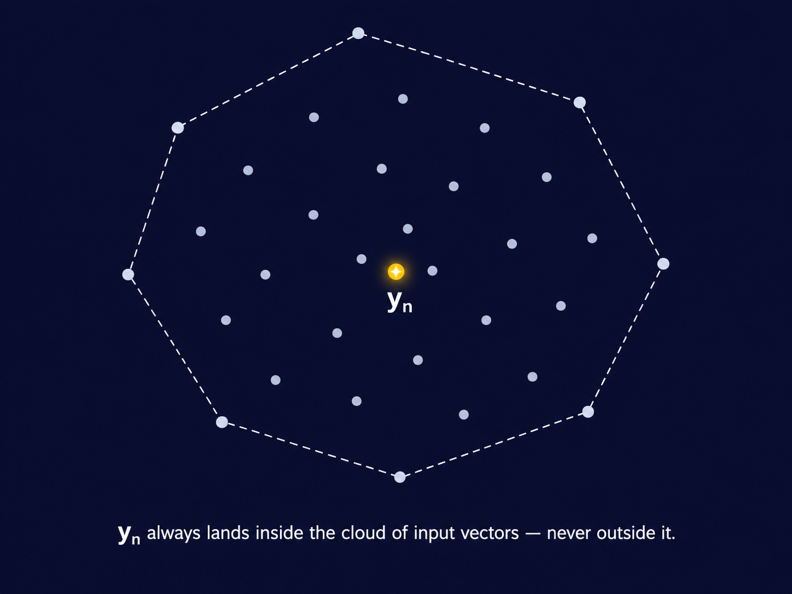
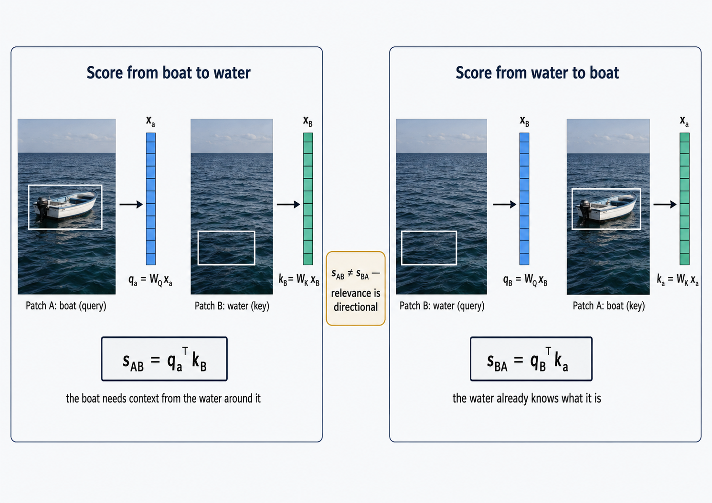
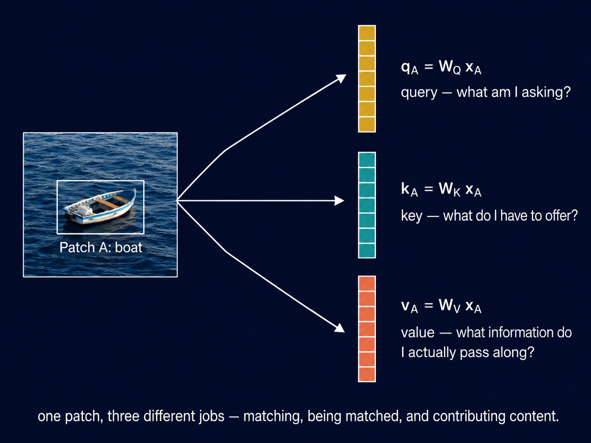

## What Does a Pixel Mean Without Its Neighbors?

Any digital image is just a matrix of numbers. Consider a satellite image of a region. Pick any pixel- say, position $(100, 100)$. Its value is $142$. What does it mean? Is it a road? A river? A rooftop? 

You cannot tell from a single number. The pixel at $(100, 100)$ only means something in relation to its
neighbors — $(99, 100)$, $(101, 100)$, $(100, 99)$. The number 142 is information, not meaning. The *relationship* between neighboring pixels gives meaning.

This is not just a quirk of satellite imagery. It is true for any kind of image. A single pixel of skin tone near your cheek tells you nothing on its own. What tells you something is the *neighborhood* the eye above it, the jaw below it and the ear to its side. The pixel derives its meaning from what surrounds it. 

Now zoom out. This is not even specific to images. A word in a sentence 
works the same way. "Bank" means something completely different depending 
on whether its neighbors are "river" and "fish" or "loan" and "interest 
rate." But we will not go there — this post stays in vision, and images 
are already rich enough to make the point.

So here is the question this post is really asking:

> **How do we build a representation of a patch of an image that is 
> informed by all the other patches?**

Not a fixed representation. But something that is *context-dependent*- one that changes based on the neighborhood, the way a pixel's meaning changes based on what surrounds it. 

This is what attention does. And it turns out the path to it runs 
through a surprisingly classical idea — the notion of **similarity** 
between vectors, and specifically, what it means to measure similarity 
*well*.

But before we get to the math, let us set the scene properly.

## Setting the Scene

Suppose we have an image. We divide it into a grid of non-overlapping 
patches — say, $16 \times 16$ pixel blocks. Each patch is flattened into 
a vector. For a colour image with 3 channels, a $16 \times 16$ patch 
gives a vector of $16 \times 16 \times 3 = 768$ numbers.

We now have a set of $N$ vectors:

$$\{\mathbf{x}_1, \mathbf{x}_2, \ldots, \mathbf{x}_N\}, \quad \mathbf{x}_i \in \mathbb{R}^D$$

Think of each $\mathbf{x}_i$ as one patch. $N$ is the number of patches. 
$D$ is the dimension of each patch vector — $768$ in the example above.

We can stack these into a matrix:

$$X = \begin{bmatrix} — & \mathbf{x}_1^T & — \\ — & \mathbf{x}_2^T & — \\ 
& \vdots & \\ — & \mathbf{x}_N^T & — \end{bmatrix} \in \mathbb{R}^{N \times D}$$

Each row is one patch. $X$ is our data matrix — $N$ patches, each with 
$D$ features.

**A note on notation.** Vectors are always column vectors. 
$\mathbf{x}_i \in \mathbb{R}^D$ means a column vector with $D$ entries — 
a $D \times 1$ matrix. When we write $\mathbf{x}_i^T$, we are transposing 
it into a row vector — a $1 \times D$ matrix. This is why the data matrix 
$X$ is built by stacking transposes: each *row* of $X$ is one patch vector 
laid on its side, giving $N$ rows and $D$ columns. Throughout this post, 
matrix-vector multiplication follows the standard convention — if 
$A \in \mathbb{R}^{m \times n}$ and $\mathbf{x} \in \mathbb{R}^n$, then 
$A\mathbf{x} \in \mathbb{R}^m$. Dimensions will be tracked at every step.

Now, the raw patch vectors $\mathbf{x}_i$ are just pixel values — low-level 
information. They have no awareness of the rest of the image. Patch 47 
does not know what patch 48 looks like, or patch 12, or patch 196.

What we want is a new set of vectors:

$$\{\mathbf{y}_1, \mathbf{y}_2, \ldots, \mathbf{y}_N\}, \quad \mathbf{y}_i \in \mathbb{R}^D$$

where $\mathbf{y}_n$ is a *richer* version of $\mathbf{x}_n$ — one that has 
looked around at the other patches and incorporated relevant information 
from them. The output matrix:

$$Y = \begin{bmatrix} — & \mathbf{y}_1^T & — \\ — & \mathbf{y}_2^T & — \\ 
& \vdots & \\ — & \mathbf{y}_N^T & — \end{bmatrix} \in \mathbb{R}^{N \times D}$$

has the same shape as $X$. Same number of patches, same dimension. But 
the representations are no longer context-free — each $\mathbf{y}_n$ has 
been informed by the whole image.

This transformation — from $X$ to $Y$, from isolated patches to 
context-aware representations — is what **self-attention** does. It 
is not the whole story of a transformer layer; a full layer includes 
more than this, which we are not building here. This post is about 
one piece only: how do we compute $Y$ from $X$ in the first place?

The question is how. And the answer starts with a deceptively simple 
idea: **weighted averaging**. Concretely, we want

$$\mathbf{y}_n = \sum_{m=1}^N a_{nm}\, \mathbf{x}_m$$

for some set of weights $a_{nm}$ — one weight for every pair of 
patches $(n, m)$, telling us how much patch $m$ contributes to the new 
representation of patch $n$. Not any set of weights, though. We want 
$\mathbf{y}_n$ to be a genuine *average* of the patches, not an 
arbitrary combination — so the weights must satisfy

$$a_{nm} \geq 0 \quad \text{for all } m, \qquad \sum_{m=1}^N a_{nm} = 1$$

Every weight is non-negative, and for each fixed $n$, the weights 
across all $m$ sum to exactly $1$. This is what makes the sum a 
*convex combination* of $\mathbf{x}_1, \ldots, \mathbf{x}_N$, rather 
than just any linear combination — $\mathbf{y}_n$ is guaranteed to sit 
somewhere inside the "cloud" of input vectors, not fly off arbitrarily 
far from all of them simply because some weight happened to be 
enormous or negative.

::: {.callout-note appearance="minimal"}
Self-attention does not obtain context from nowhere. It computes 
$\mathbf{y}_n$ as a weighted sum of all the input vectors 
$\mathbf{x}_1, \ldots, \mathbf{x}_N$, with weights satisfying the two 
constraints above. Computing those weights intelligently — that is 
self-attention's job.
:::

In the next section, we ask: what should those weights look like? And 
that question leads us directly to the mathematics of similarity.

## What Should the Weights Look Like?

We ended the last section with a question: how do we choose the weights 
$a_{nm}$ that determine how much patch $m$ contributes to the new 
representation of patch $n$?

Before answering that, we need a more basic ingredient. The weight 
$a_{nm}$ should depend on how *similar* patch $n$ and patch $m$ are. 
Similar patches should influence each other strongly. Dissimilar patches 
should barely influence each other at all. So really, the question is: 
how do we measure similarity between two vectors?

### The Naive Answer: Euclidean Distance

The most obvious measure of similarity between two vectors 
$\mathbf{x}_n, \mathbf{x}_m \in \mathbb{R}^D$ is Euclidean distance:

$$d(\mathbf{x}_n, \mathbf{x}_m) = \|\mathbf{x}_n - \mathbf{x}_m\| = 
\sqrt{(\mathbf{x}_n - \mathbf{x}_m)^T (\mathbf{x}_n - \mathbf{x}_m)}$$

Small distance means similar. Large distance means dissimilar. Simple 
enough.

But Euclidean distance makes a strong assumption that every dimension of 
$\mathbf{x}$ matters equally, and that they are uncorrelated. Let's address these issues.

The first assumption is that every dimension matters equally. Step away from pixels for a second and consider this example. Suppose you are comparing two people using two numbers: their height and shoe size. Assume heights and shoe sizes range from 150 to 185 cm and 6 to 12 respectively. A difference of 5 units in height and a difference of 5 units in shoe size **DO NOT** mean the same thing. Euclidean distance does not know and care about it. A similar thing happens with two image patches. A 30 unit pixel shift in sand or asphalt is unusual and may mean something whereas the same shift in sky could mean nothing.

The second assumption is that the dimensions are uncorrelated- that is each carries its own independent piece of information. Note that I'm using the words independent and uncorrelated very loosely, not rigorously. If one pixel in a patch is bright, the other pixel is almost always bright. Once you know one, you already know most of the others. But Euclidean distance treats them as two separate, independent entities. 

### The Dot Product, Reconsidered

Before we fix Euclidean distance, it helps to look at a different — and 
in some ways more natural — way of comparing two vectors: the dot 
product. Many of you will have seen this before, in prior coursework. 
There is nothing wrong with revisiting it — the dot product will matter 
throughout this series, and it will keep appearing, in new disguises, 
all the way to self-attention.

Most of what follows in this section will be review. I am going to be 
a little pedantic about it anyway, because the discussions coming up — 
Mahalanobis distance, and eventually queries and keys — lean on this 
machinery more heavily than it might first appear. It is worth having 
it nailed down precisely now, rather than gesturing at it later. The dot product between two vectors $\mathbf{x}_n, \mathbf{x}_m \in \mathbb{R}^D$ is defined by:

$$\mathbf{x}_n^T \mathbf{x}_m = \langle \mathbf{x}_n, \mathbf{x}_m \rangle 
= \sum_{i=1}^{D} x_{ni} \, x_{mi}$$

Both notations mean the same thing here. $\mathbf{x}_n^T \mathbf{x}_m$ 
is the matrix-multiplication way of writing it — a $1 \times D$ row 
vector times a $D \times 1$ column vector, giving a $1 \times 1$ scalar- a real number. 
$\langle \mathbf{x}_n, \mathbf{x}_m \rangle$ is the inner-product way of 
writing it — it makes no reference to rows or columns at all, just two 
vectors and an operation between them. The transpose notation is useful 
for computation. The angle-bracket notation is the one preferred in 
mathematics, and the one we will lean on when the geometry matters more 
than the arithmetic.

**Norm.** The inner product of a vector with itself gives its squared 
length:

$$\|\mathbf{x}\|^2 = \langle \mathbf{x}, \mathbf{x} \rangle$$

**Distance.** Distance is the norm of a difference:

$$d(\mathbf{x}_n, \mathbf{x}_m) = \|\mathbf{x}_n - \mathbf{x}_m\| 
= \sqrt{\langle \mathbf{x}_n - \mathbf{x}_m, \, \mathbf{x}_n - \mathbf{x}_m \rangle}$$

Inner product, norm, and distance are not three separate ideas. They 
are one idea, viewed from different angles — no pun intended, yet.

**Cauchy-Schwarz.** For any two vectors,

$$|\langle \mathbf{x}_n, \mathbf{x}_m \rangle| \leq \|\mathbf{x}_n\| \, \|\mathbf{x}_m\|$$

with equality exactly when $\mathbf{x}_n$ and $\mathbf{x}_m$ are 
parallel — one is a scalar multiple of the other. This inequality is 
doing more work than it looks like. It guarantees that the ratio

$$\frac{\langle \mathbf{x}_n, \mathbf{x}_m \rangle}{\|\mathbf{x}_n\| \, \|\mathbf{x}_m\|}$$

always lies in $[-1, 1]$ — never larger, never smaller. That is exactly 
the range of $\cos\theta$. Without Cauchy-Schwarz, there would be no 
guarantee that this ratio behaves like a cosine at all. With it, we are 
licensed to define an angle.

**Angle.** Define $\theta$, the angle between $\mathbf{x}_n$ and 
$\mathbf{x}_m$, by

$$\cos\theta = \frac{\langle \mathbf{x}_n, \mathbf{x}_m \rangle}
{\|\mathbf{x}_n\| \, \|\mathbf{x}_m\|}, 
\qquad \text{equivalently} \qquad 
\langle \mathbf{x}_n, \mathbf{x}_m \rangle = \|\mathbf{x}_n\| \, \|\mathbf{x}_m\| \cos\theta$$

This is the familiar decomposition: the inner product is the product 
of the two lengths, scaled by how aligned their directions are.

**Orthogonality**, now, is just the special case $\theta = 90°$, where 
$\cos\theta = 0$:

$$\langle \mathbf{x}_n, \mathbf{x}_m \rangle = 0$$

Geometrically, the two vectors meet at a right angle — the two edges of 
an "L." Neither has any component pointing along the other.

This is also the Pythagorean theorem, stated in inner-product language. 
Expand $\|\mathbf{x}_n - \mathbf{x}_m\|^2$ using the inner product:

$$\|\mathbf{x}_n - \mathbf{x}_m\|^2 = \|\mathbf{x}_n\|^2 
- 2\langle \mathbf{x}_n, \mathbf{x}_m \rangle + \|\mathbf{x}_m\|^2$$

When $\mathbf{x}_n$ and $\mathbf{x}_m$ are orthogonal, the cross term 
vanishes, leaving $\|\mathbf{x}_n - \mathbf{x}_m\|^2 = \|\mathbf{x}_n\|^2 
+ \|\mathbf{x}_m\|^2$ — the familiar $a^2 + b^2 = c^2$, for vectors 
instead of triangle sides.

**Similarity.** We now have everything we need to justify a claim made 
earlier without proof: that the inner product is a similarity measure.

Look again at the expansion above. Hold $\|\mathbf{x}_n\|$ and 
$\|\mathbf{x}_m\|$ fixed. The only term left to move is 
$-2\langle \mathbf{x}_n, \mathbf{x}_m \rangle$. As the inner product 
grows, this term becomes more negative, and the squared distance 
shrinks. As the inner product shrinks toward zero — orthogonality — 
distance grows toward its maximum for vectors of those fixed lengths. 
As the inner product goes negative, distance grows further still.

This is not a coincidence we are choosing to interpret favourably. For 
vectors of fixed length, the inner product and the squared distance 
between them are exact mirror images of one another. Large inner 
product is not merely *associated* with small distance — it is, up to 
the fixed-length terms, the same statement. That is why the dot product 
is entitled to be called a similarity measure and not just another real number.

**A brief step back.** Everything above used one specific inner 
product — the dot product on $\mathbb{R}^D$. But "inner product" is a 
more general notion than "dot product." Formally, an inner product on a 
vector space is any map $\langle \cdot, \cdot \rangle$ taking two 
vectors to a scalar, satisfying three properties: linearity in each 
argument, symmetry ($\langle u, v \rangle = \langle v, u \rangle$), and 
positive-definiteness ($\langle u, u \rangle \geq 0$, with equality only 
when $u = 0$). Any map satisfying these three properties automatically 
inherits everything we just built — a notion of norm 
($\|u\|^2 = \langle u, u \rangle$), a notion of distance, and a 
Cauchy-Schwarz inequality, exactly as derived above. The dot product is 
the most familiar example. It is not the only one.

This matters, because the next example is not a vector of pixel 
values at all.

**A second example.** If $X$ and $Y$ are random variables, define

$$\langle X, Y \rangle := \mathbb{E}[XY]$$

You can check this satisfies all three properties above — it is 
linear in each argument, symmetric, and $\mathbb{E}[X^2] \geq 0$, with 
equality only when $X$ is the zero random variable. So this is a 
legitimate inner product, just not one on arrows in space — it lives on 
the space of random variables.

The norm it induces is the second moment, $\|X\|^2 = \mathbb{E}[X^2]$. 
For mean-zero $X$ and $Y$, the inner product is exactly the covariance:

$$\text{Cov}(X, Y) = \mathbb{E}[XY] = \langle X, Y \rangle$$

and Cauchy-Schwarz, applied here instead of in $\mathbb{R}^D$, gives

$$\rho(X, Y) = \frac{\langle X, Y \rangle}{\|X\| \, \|Y\|} 
= \frac{\text{Cov}(X, Y)}{\sqrt{\text{Var}(X)} \sqrt{\text{Var}(Y)}} \in [-1, 1]$$

Correlation is a cosine. Not the cosine of an angle between arrows — 
the cosine of an angle between two random variables, living in the 
inner product space defined by expectation. Same inequality, same 
$\cos\theta$, different space.

**Cosine similarity.** We have now seen $\cos\theta$ appear twice — 
once for vectors in $\mathbb{R}^D$, once for random variables under 
expectation. It is worth naming this quantity properly, because it is, 
by far, the most common similarity measure you will encounter in 
machine learning.

$$\text{cossim}(\mathbf{x}_n, \mathbf{x}_m) = \cos\theta = 
\frac{\langle \mathbf{x}_n, \mathbf{x}_m \rangle}{\|\mathbf{x}_n\| \, \|\mathbf{x}_m\|}$$

This is simply the inner product, *normalized* by the two lengths. Cosine similarity asks only one question: how aligned are 
the *directions* of $\mathbf{x}_n$ and $\mathbf{x}_m$, regardless of 
length? Parallel vectors give $1$. Orthogonal vectors give $0$. 
Opposite vectors give $-1$ — and Cauchy-Schwarz is exactly what 
guarantees the number can never escape $[-1, 1]$.

**Application.** In information retrieval, recommender systems, and 
GenAI applications like RAG, cosine similarity is perhaps the most 
common way to find the vectors most similar to a query. An embedding's 
direction tends to carry the meaning, while its magnitude is often just 
an artifact of training. This is 
exactly the situation cosine similarity is built for: it discards scale 
entirely and asks only whether the directions agree. If you have ever 
called a vector database's `similarity_search` and wondered what was 
actually happening under the hood — this is it.

### A Short, Necessary Detour Through Linear Algebra

We already built inner products, norms, and distance from scratch once in this post. Now we need three more pieces of machinery, in the same spirit, before we can write down Mahalanobis distance. 

Before we can write it down properly, we need three 
things: the spectral theorem, what an eigendecomposition actually means 
geometrically, and what it means to take the square root of a matrix. 
I am not going to shortcut this. The whole point of Mahalanobis distance 
— and the reason it connects to attention later — lives inside this 
machinery, not around it. Skipping it would mean asking you to trust a 
formula instead of understanding it, and that is not how this book 
works.

If you already know this material cold, feel free to skim — the 
payoff comes in the next section, when we use all of this to derive 
Mahalanobis distance properly. But here is a TL;DR.

::: {.callout-note appearance="minimal"}
**TL;DR.** Every covariance matrix decomposes as $\Sigma = Q\Lambda Q^T$ 
— $Q$'s columns are the data's principal axes, $\Lambda$'s entries are 
the variance along each one. Since every eigenvalue is non-negative, 
we can take a matrix square root, $\Sigma^{1/2} = Q\Lambda^{1/2}Q^T$. 
We will use both facts in a moment to build Mahalanobis distance.
:::

**Random vectors.** A random vector $\mathbf{X} = (X_1, \ldots, X_D)^T$ 
is just a vector whose entries are random variables. Its mean is the 
vector of individual means, $\boldsymbol{\mu} = \mathbb{E}[\mathbf{X}] = 
(\mathbb{E}[X_1], \ldots, \mathbb{E}[X_D])^T$, and its covariance is 
the matrix $\Sigma \in \mathbb{R}^{D \times D}$ given by

$$\Sigma_{ij} = \text{Cov}(X_i, X_j) = \mathbb{E}\big[(X_i - \mathbb{E}X_i)(X_j - \mathbb{E}X_j)\big]$$

Think of $\mathbf{X}$ as a patch vector, where each $X_i$ is one pixel 
value, treated as random because it varies across the many images we 
might draw a patch from.

**The spectral theorem.** Every real symmetric matrix $\Sigma \in 
\mathbb{R}^{D \times D}$ can be written as

$$\Sigma = Q \Lambda Q^T$$

where $Q \in \mathbb{R}^{D \times D}$ is orthogonal ($Q^TQ = QQ^T = I$) 
and $\Lambda$ is diagonal, with real entries $\lambda_1 \geq \lambda_2 
\geq \cdots \geq \lambda_D$. This holds for every real symmetric 
matrix, no exceptions. A covariance matrix is always symmetric — 
$\text{Cov}(X_i, X_j) = \text{Cov}(X_j, X_i)$ — so this applies to every 
covariance matrix we will ever write down.

**What this means geometrically.** The columns of $Q$ are the 
eigenvectors of $\Sigma$ — call them $\mathbf{v}_1, \ldots, \mathbf{v}_D$, 
each a unit vector. They form an orthonormal basis: a full set of 
mutually perpendicular directions. These are the *principal axes* of 
the data.

A word of caution before going further: the eigenvalues $\lambda_i$ 
are **not** the variances of the original coordinates $X_1, \ldots, 
X_D$. That would be a different, false claim. $\text{Var}(X_i) = 
\Sigma_{ii}$, the $i$-th diagonal entry of $\Sigma$ — true by 
definition, no eigendecomposition required. What the eigenvalues 
actually capture is the variance along the eigenbasis directions, not 
along the original coordinate axes. Here is the precise statement.

Since $\{\mathbf{v}_1, \ldots, \mathbf{v}_D\}$ is an orthonormal basis, 
we can write $\mathbf{X}$ itself as a linear combination of 
eigenvectors:

$$\mathbf{X} = C_1 \mathbf{v}_1 + C_2 \mathbf{v}_2 + \cdots + C_D \mathbf{v}_D, 
\qquad C_j = \langle \mathbf{X}, \mathbf{v}_j \rangle = \mathbf{v}_j^T \mathbf{X}$$

Each $C_j$ is a scalar random variable — a specific linear combination 
of $X_1, \ldots, X_D$, telling you how much of $\mathbf{X}$ lies along 
direction $\mathbf{v}_j$. It has a variance, and we can compute it 
directly:

$$\text{Var}(C_j) = \text{Var}(\mathbf{v}_j^T\mathbf{X}) 
= \mathbb{E}\big[(\mathbf{v}_j^T\mathbf{X} - \mathbb{E}[\mathbf{v}_j^T\mathbf{X}])^2\big] 
= \mathbb{E}\big[(\mathbf{v}_j^T(\mathbf{X} - \boldsymbol{\mu}))^2\big]$$

using linearity of expectation to pull $\mathbf{v}_j^T$ through the 
mean. Write the square as an inner product with itself:

$$\mathbb{E}\big[(\mathbf{v}_j^T(\mathbf{X} - \boldsymbol{\mu}))^2\big] 
= \mathbb{E}\big[\mathbf{v}_j^T(\mathbf{X} - \boldsymbol{\mu})(\mathbf{X} - \boldsymbol{\mu})^T\mathbf{v}_j\big] 
= \mathbf{v}_j^T \, \mathbb{E}\big[(\mathbf{X} - \boldsymbol{\mu})(\mathbf{X} - \boldsymbol{\mu})^T\big] \, \mathbf{v}_j$$

pulling $\mathbf{v}_j$ outside the expectation, since it is a constant 
vector, not a random one. The matrix sitting inside the expectation is 
exactly the covariance matrix — this is just $\Sigma_{ij} = 
\text{Cov}(X_i, X_j) = \mathbb{E}[(X_i - \mu_i)(X_j - \mu_j)]$, written 
all at once instead of one entry at a time. So:

$$\text{Var}(C_j) = \mathbf{v}_j^T \Sigma \mathbf{v}_j$$

And since $\mathbf{v}_j$ is an eigenvector of $\Sigma$ with eigenvalue 
$\lambda_j$:

$$\mathbf{v}_j^T \Sigma \mathbf{v}_j = \mathbf{v}_j^T (\lambda_j \mathbf{v}_j) 
= \lambda_j \|\mathbf{v}_j\|^2 = \lambda_j$$

So $\text{Var}(C_j) = \lambda_j$. The coefficient $C_j$ — how much of 
$\mathbf{X}$ lies along the $j$-th eigenvector — is a random variable 
in its own right, and its variance is exactly the $j$-th eigenvalue. A 
large $\lambda_j$ means $\mathbf{X}$ varies a great deal along 
$\mathbf{v}_j$. A small $\lambda_j$ means it barely moves in that 
direction at all.

This is, in fact, exactly the foundation of Principal Component 
Analysis. PCA finds the directions along which a dataset varies the 
most — and those directions are precisely the eigenvectors of the 
covariance matrix, ranked by their eigenvalues. The "principal 
components" are nothing more than $\mathbf{v}_1, \mathbf{v}_2, \ldots$, 
the same eigenvectors sitting inside $Q$, and the variance "explained" 
by each one is nothing more than $\lambda_1, \lambda_2, \ldots$.

### Enter Whitening — and Mahalanobis

We now have all the linear algebra we need. Time to put it to work.

Recall that Euclidean distance treats every coordinate as equally 
informative and every coordinate as independent. Both failures share a 
single root cause. Euclidean distance is implicitly measuring things 
in a coordinate system where every axis is assumed to have equal, unit 
variance, and no axis tells you anything about any other. Real data 
does not live in such a space.

So here is the natural question. Euclidean distance gives wrong 
answers when features have unequal variance or move together — we 
established that earlier. So let's play a game. Can we find a linear 
transformation — call it $A$ — such that ordinary, unweighted 
Euclidean distance, computed *after* applying $A$, gives us the real 
distance between the original data points — the distance that 
correctly accounts for how much each direction actually varies, and 
how much different directions echo each other?

Note that we never say the original data secretly has unit variance 
and uncorrelated dimensions. The transformation we are looking for is 
a deliberate change of coordinates. The data does not change at all — 
we are only relabeling it. If we can find such an $A$, we get to keep 
using the simplest possible notion of distance — we just measure it in 
the right coordinates first.

**Finding $A$.** We want $\mathbf{Y} = A\mathbf{X}$ such that 
$\text{Cov}(\mathbf{Y}) = I$ — every direction unit variance, no 
correlation between any pair of coordinates. This is called 
*whitening*. Using $\text{Cov}(A\mathbf{X}) = A\Sigma A^T$, the 
condition we need is:

$$A \Sigma A^T = I$$

Try $A = R\Lambda^{-1/2}Q^T$, for some matrix $R$ we have not yet 
chosen, where $\Sigma = Q\Lambda Q^T$ is the spectral decomposition 
from the last section. Substitute:

$$A\Sigma A^T = \big(R\Lambda^{-1/2}Q^T\big)\big(Q\Lambda Q^T\big)\big(Q\Lambda^{-1/2}R^T\big) 
= R\Lambda^{-1/2}\big(Q^TQ\big)\Lambda\big(Q^TQ\big)\Lambda^{-1/2}R^T$$

Since $Q$ is orthogonal, $Q^TQ = I$, so this collapses:

$$A\Sigma A^T = R\Lambda^{-1/2}\Lambda\Lambda^{-1/2}R^T = R\,I\,R^T = RR^T$$

So the whole condition reduces to $RR^T = I$ — $R$ can be **any 
orthogonal matrix**. There is no single whitening transform; there is 
a whole family of them. Two common choices: $R = I$ gives $A = 
\Lambda^{-1/2}Q^T$ (rotate into the eigenbasis, rescale, stop). $R = Q$ 
gives $A = Q\Lambda^{-1/2}Q^T = \Sigma^{-1/2}$ (rotate in, rescale, 
rotate back out — symmetric by construction).

**The fact that matters.** Compute $A^TA$ for a general orthogonal $R$:

$$A^TA = \big(R\Lambda^{-1/2}Q^T\big)^T\big(R\Lambda^{-1/2}Q^T\big) 
= Q\Lambda^{-1/2}R^TR\Lambda^{-1/2}Q^T 
= Q\Lambda^{-1/2}\Lambda^{-1/2}Q^T = Q\Lambda^{-1}Q^T = \Sigma^{-1}$$

using $R^TR = I$ in the third step. **$A^TA = \Sigma^{-1}$, no matter 
which orthogonal $R$ you picked.** The choice of $R$ changes $A$ 
itself, but never changes $A^TA$.

**Distance in the whitened space.** Once we have whitened the data, 
ordinary Euclidean distance, computed *on the whitened vectors*, is no 
longer making the false assumptions it was making before — because in 
the whitened space, those assumptions are true by construction. Let's 
write this out explicitly, one step at a time. Define $\mathbf{Y}_n := 
A\mathbf{X}_n$ and $\mathbf{Y}_m := A\mathbf{X}_m$. The Euclidean 
distance between the whitened vectors is:

$$d(\mathbf{Y}_n, \mathbf{Y}_m)^2 = d(A\mathbf{X}_n, A\mathbf{X}_m)^2 
= \|A\mathbf{X}_n - A\mathbf{X}_m\|^2$$

Factor $A$ out of the difference:

$$\|A\mathbf{X}_n - A\mathbf{X}_m\|^2 = \|A(\mathbf{X}_n - \mathbf{X}_m)\|^2$$

Expand the squared norm as an inner product with itself:

$$\|A(\mathbf{X}_n - \mathbf{X}_m)\|^2 
= \big(A(\mathbf{X}_n - \mathbf{X}_m)\big)^T\big(A(\mathbf{X}_n - \mathbf{X}_m)\big) 
= (\mathbf{X}_n - \mathbf{X}_m)^T A^TA (\mathbf{X}_n - \mathbf{X}_m)$$

And we just showed $A^TA = \Sigma^{-1}$, regardless of which orthogonal 
$R$ we picked. So, putting the whole chain together:

$$d(\mathbf{Y}_n, \mathbf{Y}_m)^2 = (\mathbf{X}_n - \mathbf{X}_m)^T \Sigma^{-1} (\mathbf{X}_n - \mathbf{X}_m)$$

This is **Mahalanobis distance**, which we will now write as 
$d_M(\mathbf{X}_n, \mathbf{X}_m)^2$. It is not a separately invented 
formula bolted onto Euclidean distance to fix it after the fact. It 
*is* Euclidean distance — applied honestly, in the coordinate system 
where Euclidean distance's assumptions actually hold.

::: {.callout-note appearance="minimal"}
Set $\Sigma = I$ — pretend the data has unit variance in every 
direction and no correlation between any pair of coordinates — and 
Mahalanobis distance collapses exactly to ordinary Euclidean distance. 
Euclidean distance is not a different idea from Mahalanobis distance. 
It is the special case where you have decided, without evidence, that 
no whitening was necessary to begin with.
:::

So $\Sigma^{-1}$ is doing real work: rotate into the eigenbasis 
(decorrelate), rescale each axis by the inverse of its variance 
(equalize), rotate back if you like (optional, and irrelevant to the 
final distance either way). One matrix, estimated once from the 
statistics of the data, applied uniformly to every pair of vectors we 
ever compare.

And this raises the question that has been waiting since the start of 
this post. Look again at what $\Sigma^{-1}$ actually is. It is a fixed 
number, computed once, from the statistics of an entire dataset — every 
patch, from every image, averaged together. It does not know what task 
we are solving. It does not know what this *particular* image, or this 
*particular* patch, actually needs or actually is. It captures the *average* notion 
of "what varies, and what's correlated," across everything we have ever 
seen, and then applies that one average notion everywhere, forever.

Look at the formula 
itself:

$$d_M(\mathbf{x}_n, \mathbf{x}_m)^2 = (\mathbf{x}_n - \mathbf{x}_m)^T \, \Sigma^{-1} \, (\mathbf{x}_n - \mathbf{x}_m)$$

Here is the question worth sitting with. As the formula is written, 
$\Sigma^{-1}$ is one fixed matrix, used identically no matter which 
two patches we plug in. But nothing about the *idea* of a matrix sitting 
between two vectors requires this. We could write down a more general 
version of this formula — one where the matrix in the middle is allowed 
to change depending on which two patches, within the same image, are 
actually being compared: different when comparing the patch containing 
a boat to the patch of water right next to it, than when comparing two 
patches that are both plain, empty sky. 

## What If the Matrix Weren't Fixed?

We spent the last section deriving the Mahalanobis distance from the whitening transformation. But $\Sigma^{-1}$ is still a fixed matrix: estimated once from the 
statistics of an entire dataset, then applied identically to every 
pair of patches we would ever compare. It is time to ask what happens 
when we let that go.

### A Wishlist

Let's ask the what-if question properly this time, with a wishlist in 
hand before we reach for any formula.

We want a similarity score between two patches, $\mathbf{x}_n$ and $\mathbf{x}_m$, that improves on Mahalanobis distance in one specific 
way: it should be allowed to depend on *which* patch is asking the 
question. Beyond that, here is what we want from it.

1. **It should still be built from a matrix sitting between two vectors.** 
We are not abandoning the geometric machinery of this entire post — 
inner products, quadratic forms, all of it. We want to keep using a 
matrix, the way $\Sigma^{-1}$ was a matrix. We are only asking the 
matrix to do more.

2. **It should not have to be symmetric.** This is the part that breaks 
from Mahalanobis outright. $\Sigma^{-1}$ is symmetric — the similarity 
of $\mathbf{x}_n$ to $\mathbf{x}_m$ is identical to the similarity of 
$\mathbf{x}_m$ to $\mathbf{x}_n$, no matter which one you call "first." 
But think again about a patch of boat sitting in a patch of water. 
The boat patch needs the water patch — it tells the boat patch whether 
it is floating, moving, in open water or near a shore. The water 
patch, on the other hand, gains very little from knowing about the 
boat — it already knows it is water from the waves and shoreline 
around it. Relevance, in other words, can be *directional*. What patch 
$n$ needs from patch $m$ need not equal what patch $m$ needs from 
patch $n$. A symmetric matrix can never capture this. We need to let 
that constraint go.

A quick note on what "score from boat to water" means here: it is the 
score *patch A computes when looking at patch B* — how much the water 
patch matters, from the boat patch's point of view. "Score from water 
to boat" is the reverse — how much the boat matters, from the water's 
point of view. The image makes the point that these two numbers need 
not be equal. We will give the two roles in this asymmetry — the 
"asker" and the "answerer" — proper names, query and key, by the end 
of this section.

3. **It should still come from a linear map.** We are not yet ready to 
give up linearity — that is a much bigger leap, and not one this post 
needs to make. We want the new, more flexible matrix to still arise 
from a simple linear transformation of the original vectors, the same 
spirit as $A\mathbf{x}$ in the whitening section.

4. **It should reduce to something like the inner product.** Whatever we 
end up with, plugging in the simplest possible choices should recover 
the dot product we started this whole post with — not a completely 
unrelated quantity.

With this wishlist in hand, a natural question arises before we even 
attempt a construction: could one matrix possibly satisfy all four? 
Specifically — item 2 demanded asymmetry. Can a single shared matrix, 
applied to both patches, ever give us that?

### Why Two Matrices, Not One?
It is worth checking this directly, 
because the answer is not obvious until you do the algebra. Suppose we 
tried a single shared matrix $W$, applied to both patches:

$$\mathbf{q}_n = W\mathbf{x}_n, \qquad \mathbf{k}_m = W\mathbf{x}_m, 
\qquad \text{score}(n,m) = \mathbf{x}_n^T W^TW \mathbf{x}_m$$

Let $S := W^TW$, so $\text{score}(n,m) = \mathbf{x}_n^TS\mathbf{x}_m$. 
Since this is a scalar, it equals its own transpose:

$$\mathbf{x}_n^TS\mathbf{x}_m = (\mathbf{x}_n^TS\mathbf{x}_m)^T 
= \mathbf{x}_m^TS^T\mathbf{x}_n = \mathbf{x}_m^TS\mathbf{x}_n 
= \text{score}(m,n)$$

using $S^T = (W^TW)^T = W^TW = S$ in the second-to-last step. So 
$\text{score}(n,m) = \text{score}(m,n)$ — a single shared matrix can 
only ever produce a symmetric similarity. One matrix fails item 2, no 
matter how it's chosen. We need two genuinely different matrices, one 
for each role.

With this settled, here is the natural construction. Instead of 
applying one matrix to both $\mathbf{x}_n$ and $\mathbf{x}_m$ 
identically, apply *two different* linear maps — one to each:

$$\mathbf{q}_n = W_Q \mathbf{x}_n, \qquad \mathbf{k}_m = W_K \mathbf{x}_m$$

where $W_Q, W_K \in \mathbb{R}^{d \times D}$ are two, generally 
different, matrices. Now define the similarity between patch $n$ and 
patch $m$ as the inner product of these transformed vectors:

$$\text{score}(n, m) = \mathbf{q}_n^T \mathbf{k}_m = \mathbf{x}_n^T W_Q^T W_K \, \mathbf{x}_m$$

Check this against the full wishlist. It is still a matrix sitting 
between two vectors — the matrix is $M := W_Q^T W_K$ — satisfying item 
1. It need not be symmetric: $M^T = W_K^T W_Q$, which is generally not 
equal to $M = W_Q^T W_K$ unless $W_Q = W_K$. So $\text{score}(n,m) \neq 
\text{score}(m,n)$, in general — item 2, satisfied. It still comes from 
linear maps — $W_Q$ and $W_K$ are both linear transformations — 
satisfying item 3. And it reduces to the plain inner product the 
moment $W_Q = W_K = I$ — item 4, satisfied.

$\mathbf{q}_n$ is called a **query** — what patch $n$ is asking about. 
$\mathbf{k}_m$ is called a **key** — what patch $m$ has to offer, as 
seen by anyone asking. We have, without quite announcing it, just 
written down the $Q$ and $K$ of self-attention.

### From a Score to a Weight

Remember where this entire post started. Back in "Setting the 
Scene," we said $\mathbf{y}_n$ would be a weighted sum of the other 
patches:

$$\mathbf{y}_n = \sum_{m=1}^N a_{nm}\,\mathbf{x}_m$$

A score is not yet a weight. $\text{score}(n,m) = \mathbf{q}_n^T\mathbf{k}_m$ 
can be any real number — negative, larger than one, completely 
unconstrained. The weights $a_{nm}$, on the other hand, were required 
from the very beginning to satisfy $a_{nm} \geq 0$ and $\sum_m a_{nm} = 
1$ — a proper weighted average, not just any combination. We have 
built the similarity. We have not yet built the average.

That conversion — from an unconstrained score to a valid set of 
weights that sum to one — is the job of **softmax**, and it is exactly 
where this post ends and the next one begins.

$$a_{nm} = \frac{\exp(\text{score}(n,m))}{\sum_{m'=1}^N \exp(\text{score}(n,m'))}$$

Readers will recognize this as the **softmax** function used in multi-class classification problems. For now, notice 
only the shape of where we have landed. Start with raw pixel values. 
Ask what it would mean to measure similarity between two patches well. 
Pass through Euclidean distance, Mahalanobis distance, queries and 
keys. Arrive, finally, at the softmax.  
Plug those weights back into the formula we wrote at the very start. 

$$\mathbf{y}_n = \sum_{m=1}^N a_{nm}\,\mathbf{x}_m$$

### What's Still Missing

This is close to self-attention, but not quite there yet. A few things 
are still missing, worth naming honestly rather than glossing over.

1. **The softmax mechanism, applied here, has not actually been 
   shown.** We have written down a similarity score, 
   $\text{score}(n,m) = \mathbf{q}_n^T\mathbf{k}_m$, and we have written 
   down the softmax formula above — but the specific way these combine, 
   including how the scores are scaled before the exponential, has not 
   been derived. You already know softmax in general. This is a short 
   step that will be taken later.

2. **$W_Q$ and $W_K$ have no closed-form recipe.** Even with softmax 
   applied, $a_{nm}$ depends entirely on $W_Q$ and $W_K$ — and we have 
   said nothing about where those matrices actually come from. Recall 
   that $\Sigma^{-1}$, back in Mahalanobis distance, had a closed-form 
   answer: estimate the covariance of the data, invert it, done. $W_Q$ 
   and $W_K$ have no such recipe. They have to be *learned* — found by 
   some process that adjusts them based on how well the resulting 
   $\mathbf{y}_n$ serves whatever task the network is trying to solve. 
   We have not said anything about what that process looks like. That 
   omission is not minor. It is most of what separates "we have written 
   down a plausible formula" from "we have a trainable mechanism."

3. **We have been averaging the raw vectors $\mathbf{x}_m$, not 
   values.** The formula we have used throughout this post is

   $$\mathbf{y}_n = \sum_{m=1}^N a_{nm}\,\mathbf{x}_m, \qquad 
   a_{nm} = \text{softmax}_m\big(\mathbf{q}_n^T\mathbf{k}_m\big)$$

   Nothing forces us to keep it that way. The weights $a_{nm}$ already 
   come from learned projections — $\mathbf{q}_n$ and $\mathbf{k}_m$ — 
   rather than the raw vectors directly. So why should the *thing being 
   averaged* stay unprojected? Self-attention, properly built, makes one 
   more substitution: replace $\mathbf{x}_m$ inside the sum with a 
   third, separately learned projection of each patch, $\mathbf{v}_m = 
   W_V\mathbf{x}_m$, called a **value** vector, distinct from the query and the 
   key:

   $$\mathbf{y}_n = \sum_{m=1}^N a_{nm}\,\mathbf{v}_m$$

   We flagged this back in our very first callout and have not returned 
   to it until now.

   The one-line reason it exists: queries and keys answer "how much 
   does patch $m$ matter to patch $n$," but that is a different question 
   from "what information should actually be averaged in, once we know 
   how much it matters." Forcing the raw $\mathbf{x}_m$ to answer both 
   questions makes one vector do two jobs that have no reason to be 
   tied together. A patch might be a very strong *match* for patch $n$ 
   — high $\mathbf{q}_n^T\mathbf{k}_m$ — while the *content* worth 
   passing along from it is something other than its raw pixel values. 
   The value vector lets the network learn what to contribute 
   separately from what makes it relevant in the first place — exactly 
   the way query and key separated "what am I asking" from "what do I 
   have to offer."

   

   We will build this properly in the next post.

4. **Everything we built is linear.** $A\mathbf{x}$ in whitening. 
   $W_Q\mathbf{x}_n$ and $W_K\mathbf{x}_m$ for the query and key. The 
   value vector is no different: $W_V\mathbf{x}_m$, another linear map. 
   Self-attention, as derived so far, contains no nonlinearity beyond 
   softmax itself, which normalizes rather than transforms.

   Here is why that matters. A composition of linear maps is still a 
   linear map. If $A$ and $B$ are both linear transformations, then 
   $B(A\mathbf{x})$ is just another single linear transformation of 
   $\mathbf{x}$ — nothing is gained in expressive power by stacking 
   them. This means a system built entirely out of self-attention, no 
   matter how many layers of it you stack, could not represent anything 
   more expressive than one large linear function. Linear maps, however 
   cleverly arranged, cannot bend, fold, or curve a space — and most of 
   the patterns worth learning from images are not linear.

   This is precisely the problem that motivates introducing genuine 
   nonlinearity — an operation that cannot be undone or replicated by 
   any single matrix multiplication. Stack enough nonlinear operations 
   together, interleaved with linear ones, and you get a 
   **neural network**. Self-attention, as built in this post, is only 
   one ingredient of such a system. A real transformer block also needs 
   a feedforward network with a genuine nonlinear activation, residual 
   connections, and layer normalization — applied together in a 
   specific arrangement, stacked many times over. There is more to 
   attention itself, too — running several differently-projected 
   versions of it in parallel, rather than just one. None of that has 
   been built yet. It is coming, in the subsequent posts.

## Conclusion

The neural network architecture you get by putting all of these pieces 
together — self-attention, value vectors, feedforward layers, residual 
connections, stacked block after block — is called the **transformer**. 
It is the foundation, pun intended, of every large language model and 
large vision model in existence today: GPT, Claude, Gemini, and the 
rest. Everything in this post was an attempt to arrive at one small 
piece of that foundation honestly, rather than simply being told it 
works.

The next post turns this into running code — softmax applied properly, 
$W_Q$, $W_K$, $W_V$ initialized and learned, and self-attention built, 
end to end, in NumPy and PyTorch.
