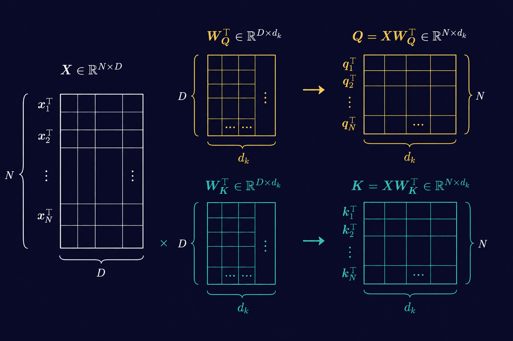
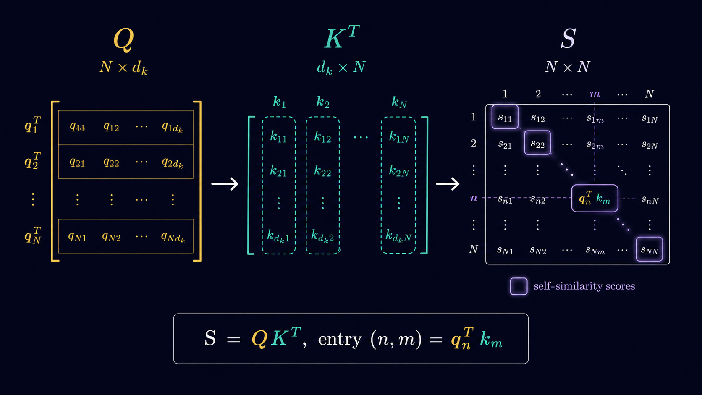
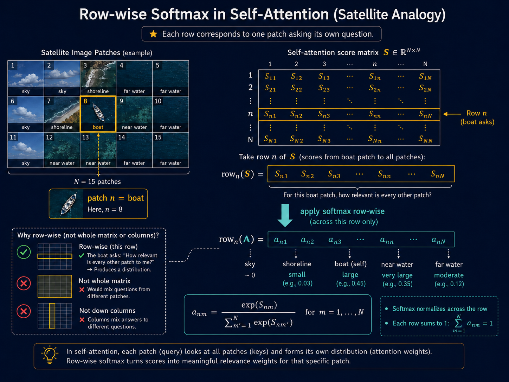
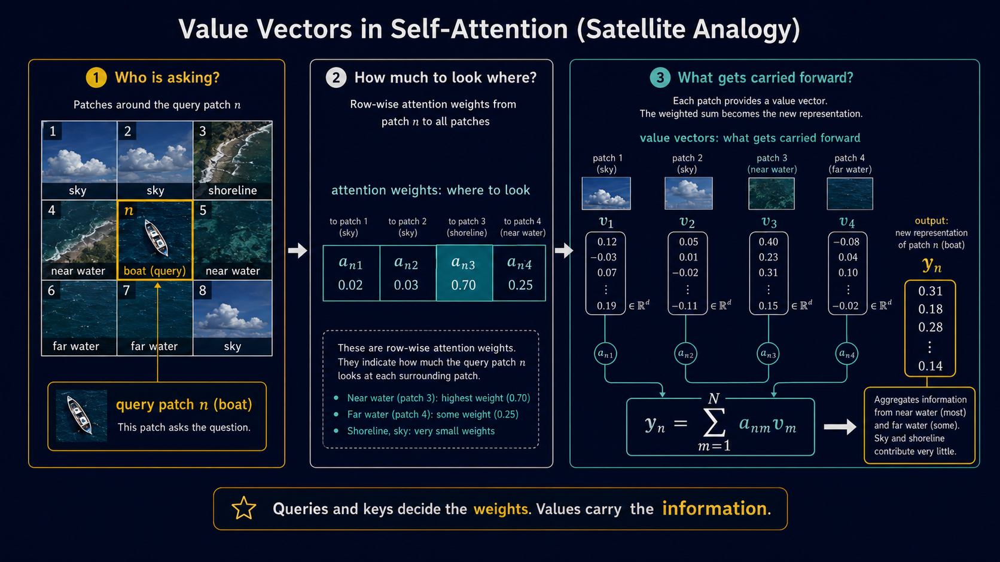
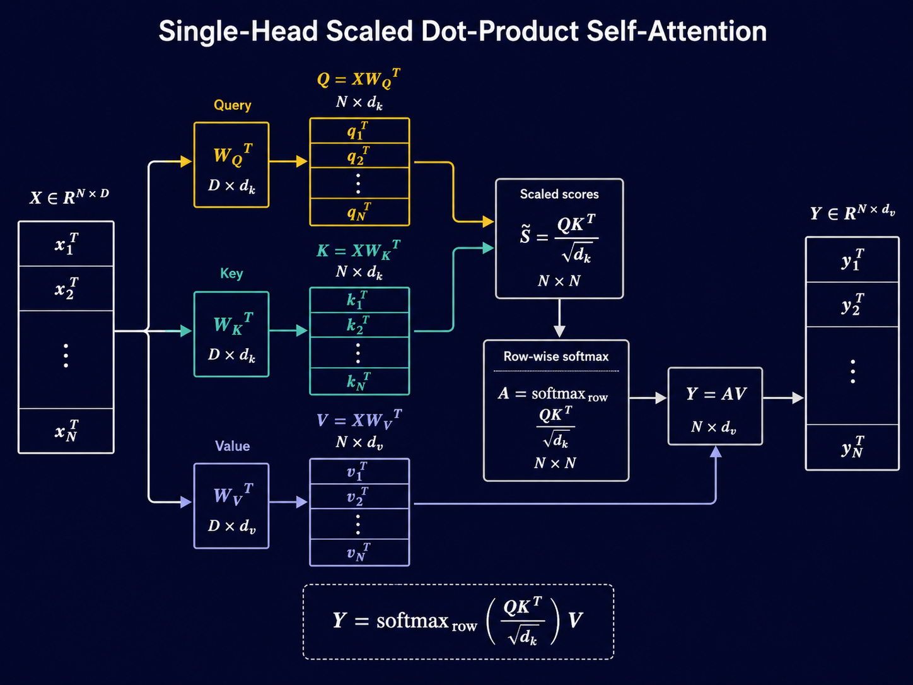

---
title: "Self-Attention From First Principles — Part 2"
subtitle: "Scaled dot-product attention, multi-head attention, and the code"
author: "Madhav Prashanth Ramachandran"
date: "2026-06-24"
categories: [transformers, vision, attention, linear-algebra, numpy, pytorch]
format:
  html:
    toc: true
    toc-depth: 3
    number-sections: true
    html-math-method: mathjax
    fig-align: center
    theme: cosmo
    css: styles.css
    page-layout: article
---

## Picking Up Where We Left Off

[Part 1](https://madhavpr191221.github.io/transformers_for_perception/posts/self-attention-from-first-principles/index.html) ended with self-attention almost fully derived — queries, keys, 
a similarity score, and a weighted average. Almost, because we left two things unfinished.

**First, the softmax itself. **

Machine learning practioners recognize softmax immediately. But, it turns out that the raw form of softmax needs a simple but non-trivial modification to make the computation numerically and statistically well-behaved. Rather than simply stating it as a fact, we will derive it from first principles with a simple numerical example to support the theory. 

**Second, the value vector.**

We averaged raw patch vectors $\mathbf{x}_m$ 
throughout Part 1, and flagged at the end that real self-attention 
averages a separately learned projection instead. We deferred the 
construction intetionally. This post builds it. 

Spoiler Alert: The value vector isn't magical. It is just matrix-vector multiplication

**Third, multi-head attention.**

Third, we worked with one query and one key projection throughout. In practice, self-attention runs several different key and query projections in parallel. You can think about attaching different "importance scores" to each patch in different ways. This is called Multi-Head Attention and it is the last piece of the self-attention story.

If you haven't read Part 1, start there. It explains the idea of self-attention from first principles, using a satellite image as a running example instead of beginning with natural language tokens. The mathematics is not there for decoration. It is the medium through which the story comes alive.

## From Vectors to Matrices

In Part 1, we derived a similarity score between two patches $\mathbf{x}_n$ and $\mathbf{x}_m$:

$$
\text{score}(n,m) = \mathbf{q}_n^\top \mathbf{k}_m,
\qquad
\mathbf{q}_n = W_Q \mathbf{x}_n,
\qquad
\mathbf{k}_m = W_K \mathbf{x}_m.
$$

Roughly speaking, $\text{score}(n,m)$ measures how well what patch $n$ is asking for matches what patch $m$ has to offer.

We worked with individual patch vectors throughout Part 1. Now we need to scale this up: not one query and one key, but $N$ queries and $N$ keys — one for every patch in the image. And we want to compute all $N^2$ similarity scores at once, not one at a time.

To do that cleanly, we first need to be precise about dimensions.

### Dimensions

Each patch vector is a column vector:

$$
\mathbf{x}_n \in \mathbb{R}^{D}.
$$

The matrix $W_Q$ acts on vectors in $\mathbb{R}^{D}$, so it must have $D$ columns. Similarly, $W_K$ also acts on vectors in $\mathbb{R}^{D}$, so it too must have $D$ columns.

Suppose

$$
W_Q \in \mathbb{R}^{d_q \times D},
\qquad
W_K \in \mathbb{R}^{d_k \times D}.
$$

Then matrix-vector multiplication gives

$$
\mathbf{q}_n = W_Q \mathbf{x}_n \in \mathbb{R}^{d_q},
\qquad
\mathbf{k}_m = W_K \mathbf{x}_m \in \mathbb{R}^{d_k}.
$$

But the attention score is defined as a dot product:

$$
\text{score}(n,m)
=
\mathbf{q}_n^\top \mathbf{k}_m.
$$

For this dot product to make sense, $\mathbf{q}_n$ and $\mathbf{k}_m$ must live in the same space. Therefore,

$$
d_q = d_k.
$$

We call this common dimension $d_k$. So from here on,

$$
W_Q \in \mathbb{R}^{d_k \times D},
\qquad
W_K \in \mathbb{R}^{d_k \times D},
$$

and

$$
\mathbf{q}_n, \mathbf{k}_m \in \mathbb{R}^{d_k}.
$$

### Building the Query and Key Matrices

The data matrix $X \in \mathbb{R}^{N \times D}$ stores patch vectors as rows:

$$
\operatorname{row}_n(X) = \mathbf{x}_n^\top.
$$

We build $Q$ the same way, by storing query vectors as rows:

$$
Q \in \mathbb{R}^{N \times d_k},
\qquad
\operatorname{row}_n(Q) = \mathbf{q}_n^\top.
$$

Now use the individual-vector definition:

$$
\mathbf{q}_n = W_Q \mathbf{x}_n.
$$

Taking transpose,

$$
\mathbf{q}_n^\top
=
(W_Q \mathbf{x}_n)^\top
=
\mathbf{x}_n^\top W_Q^\top.
$$

Therefore,

$$
\operatorname{row}_n(Q)
=
\operatorname{row}_n(X) W_Q^\top.
$$

Since this holds for every row,

$$
Q = XW_Q^\top.
$$

The dimensions are:

$$
X \in \mathbb{R}^{N \times D},
\qquad
W_Q^\top \in \mathbb{R}^{D \times d_k},
\qquad
Q \in \mathbb{R}^{N \times d_k}.
$$

So,

$$
Q = XW_Q^\top \in \mathbb{R}^{N \times d_k}.
$$

By the same argument,

$$
K = XW_K^\top \in \mathbb{R}^{N \times d_k}.
$$

The transpose appears only because individual patch vectors are column vectors, while the data matrix stores patches as rows.

Explicitly, the query matrix is obtained by stacking the query vectors row by row:

$$
Q
=
\begin{bmatrix}
\mathbf{q}_1^\top \\
\mathbf{q}_2^\top \\
\vdots \\
\mathbf{q}_N^\top
\end{bmatrix}.
$$

Since $\mathbf{q}_i = W_Q \mathbf{x}_i$, each row becomes

$$
\mathbf{q}_i^\top
=
(W_Q \mathbf{x}_i)^\top
=
\mathbf{x}_i^\top W_Q^\top.
$$

So,

$$
Q
=
\begin{bmatrix}
\mathbf{x}_1^\top W_Q^\top \\
\mathbf{x}_2^\top W_Q^\top \\
\vdots \\
\mathbf{x}_N^\top W_Q^\top
\end{bmatrix}
=
\begin{bmatrix}
\mathbf{x}_1^\top \\
\mathbf{x}_2^\top \\
\vdots \\
\mathbf{x}_N^\top
\end{bmatrix}
W_Q^\top
=
XW_Q^\top.
$$

Therefore,

$$
Q = XW_Q^\top \in \mathbb{R}^{N \times d_k}.
$$

By the same reasoning,

$$
K = XW_K^\top \in \mathbb{R}^{N \times d_k}.
$$

{#fig-query-key-matrices}

### The Score Matrix

We want a score matrix $S \in \mathbb{R}^{N \times N}$ whose $(n,m)$-th entry is

$$
S_{nm}
=
\text{score}(n,m)
=
\mathbf{q}_n^\top \mathbf{k}_m.
$$

Fix row $n$ of $S$. Its entries are

$$
S_{n1}, S_{n2}, \ldots, S_{nN}.
$$

Written as a row vector,

$$
\operatorname{row}_n(S)
=
\begin{bmatrix}
\mathbf{q}_n^\top \mathbf{k}_1
&
\mathbf{q}_n^\top \mathbf{k}_2
&
\cdots
&
\mathbf{q}_n^\top \mathbf{k}_N
\end{bmatrix}.
$$

Factor out $\mathbf{q}_n^\top$:

$$
\operatorname{row}_n(S)
=
\mathbf{q}_n^\top
\begin{bmatrix}
\mathbf{k}_1
&
\mathbf{k}_2
&
\cdots
&
\mathbf{k}_N
\end{bmatrix}.
$$

But

$$
\begin{bmatrix}
\mathbf{k}_1
&
\mathbf{k}_2
&
\cdots
&
\mathbf{k}_N
\end{bmatrix}
=
K^\top.
$$

Therefore,

$$
\operatorname{row}_n(S)
=
\mathbf{q}_n^\top K^\top.
$$

Since the $n$-th row of $Q$ is $\mathbf{q}_n^\top$,

$$
\operatorname{row}_n(S)
=
\operatorname{row}_n(Q)K^\top.
$$

Stacking this for all $n = 1,\ldots,N$, we get

$$
S = QK^\top.
$$

The dimensions are:

$$
Q \in \mathbb{R}^{N \times d_k},
\qquad
K^\top \in \mathbb{R}^{d_k \times N},
\qquad
S \in \mathbb{R}^{N \times N}.
$$

So the full score matrix is

$$
S = QK^\top \in \mathbb{R}^{N \times N}.
$$

Now expand this in terms of $X$, $W_Q$, and $W_K$:

$$
S
=
QK^\top.
$$

{#fig-q_k_transpose}

### Analogy with the Mahalanobis Distance

Using

$$
Q = XW_Q^\top,
\qquad
K = XW_K^\top,
$$

the score matrix can be rewritten as

$$
S
=
QK^\top
=
(XW_Q^\top)(XW_K^\top)^\top
=
XW_Q^\top W_KX^\top.
$$

Define

$$
M := W_Q^\top W_K.
$$

Then

$$
S = XMX^\top,
\qquad
S_{nm} = \mathbf{x}_n^\top M \mathbf{x}_m.
$$

So the attention score is a learned bilinear similarity between two patch vectors.

This is the connection to Part 1: in the Mahalanobis form, the middle matrix is $\Sigma^{-1}$. In self-attention, the middle matrix is learned:

$$
M = W_Q^\top W_K.
$$

Unlike $\Sigma^{-1}$, this matrix need not be symmetric. That is important because attention itself need not be symmetric: patch $n$ attending to patch $m$ does not imply that patch $m$ attends equally strongly back to patch $n$.

## Scaled Dot-Product Attention

### From Scores to Attention Weights

We now have a score matrix $$ S = QK^\top \in \mathbb{R}^{N \times N}. $$ The entry $S_{nm}$ measures how strongly patch $n$ matches patch $m$. But these raw scores are (arbitrary) real numbers. To turn them into attention weights, we apply the softmax operation row by row. 

Why row by row? Because each row corresponds to one patch asking its own question. Suppose patch $n$ contains a boat. The raw score answers the question: for this boat patch, how relevant is every other patch? Softmax just normalizes across this row and turns them into probabilities. 

{#fig-row-wise-softmax}

### Softmax Has a Scale Problem

There is one thing we have quietly ignored.

Softmax is not just a ranking function.

Take one row of scores. Suppose the boat patch gives the following scores to three surrounding patches:

$$
\begin{bmatrix}
1 & 2 & 3
\end{bmatrix},
$$

Softmax applied above gives approximately

$$
\operatorname{softmax}
\left(
\begin{bmatrix}
1 & 2 & 3
\end{bmatrix}
\right)
\approx
\begin{bmatrix}
0.09 & 0.24 & 0.67
\end{bmatrix}.
$$

The third patch matters the most, but the other two patches still have finite contribution.

If the same patch produces a score, 

$$
\begin{bmatrix}
10 & 20 & 30
\end{bmatrix},
$$

softmax is essentially

$$
\operatorname{softmax}
\left(
\begin{bmatrix}
10 & 20 & 30
\end{bmatrix}
\right)
\approx
\begin{bmatrix}
0 & 0 & 1
\end{bmatrix}.
$$

The ordering of the scores has not changed but the third patch has completely swallowed the other two. 

The question is not only: Which patch has the highest score but also how large are the gaps between scores? 

Take one query patch $n$. Suppose we compare how much attention patch $n$ gives to two patches: patch $m$ and patch $m'$. 

The corresponding attention weights are $$ a_{nm} = \frac{\exp(S_{nm})} {\sum_{j=1}^{N}\exp(S_{nj})}, \qquad a_{nm'} = \frac{\exp(S_{nm'})} {\sum_{j=1}^{N}\exp(S_{nj})}. $$ 

$$ \frac{a_{nm}}{a_{nm'}} = \frac{\exp(S_{nm})}{\exp(S_{nm'})}. $$ 

Therefore, $$ \frac{a_{nm}}{a_{nm'}} = \exp(S_{nm} - S_{nm'}). $$ 

This is the important point. Softmax does not compare $S_{nm}$ and $S_{nm'}$ in isolation. It compares them through the difference $$ S_{nm} - S_{nm'}. $$ So the gap between the two scores controls how much more attention patch $m$ receives compared to patch $m'$.

### How Large Are the Score Gaps?

This is now the real question.

For any (satellite) image, $S_{nm}$ is just a number. So is $S_{nm'}$. Their difference is also just a number.

But to understand the gaps better, let's change our point-of-view and think of these scores as realizations of random variables.

Let

$$
\mathcal{S}_{nm}
$$

denote the random score between query patch $n$ and key patch $m$.

The realized value inside the score matrix is

$$
S_{nm}.
$$

Similarly, the score gap

$$
S_{nm} - S_{nm'}
$$

is a realization of the random variable

$$
\mathcal{S}_{nm} - \mathcal{S}_{nm'}.
$$

So when we ask how large the score gap is, we are really asking:

> What is the typical scale of the random variable $\mathcal{S}_{nm} - \mathcal{S}_{nm'}$?

A natural way to measure this typical scale is its standard deviation.

The standard deviation does not tell us the exact gap for a particular image. It gives us a rough sense of how large such gaps usually are.

And that is exactly what softmax cares about, because the ratio of two attention weights is

$$
\frac{a_{nm}}{a_{nm'}}
=
\exp(S_{nm} - S_{nm'}).
$$

So if the typical size of

$$
S_{nm} - S_{nm'}
$$

grows, then the exponentials inside softmax become more extreme.

So let us estimate the standard deviation of the random gap

$$
\mathcal{S}_{nm} - \mathcal{S}_{nm'}.
$$

Assume that the entries of the random query vector and random key vector have mean zero and variance one:

$$
\mathbb{E}[\mathcal{Q}_{nj}] = 0,
\qquad
\mathbb{E}[\mathcal{K}_{mj}] = 0,
$$

and

$$
\operatorname{Var}(\mathcal{Q}_{nj}) = 1,
\qquad
\operatorname{Var}(\mathcal{K}_{mj}) = 1.
$$

Also assume that the terms in the dot product are independent.

The random score between patch $n$ and patch $m$ is

$$
\mathcal{S}_{nm}
=
\mathcal{Q}_n^\top \mathcal{K}_m
=
\sum_{j=1}^{d_k} \mathcal{Q}_{nj}\mathcal{K}_{mj}.
$$

Now consider one term in this sum:

$$
\mathcal{Q}_{nj}\mathcal{K}_{mj}.
$$

Since $\mathcal{Q}_{nj}$ and $\mathcal{K}_{mj}$ are independent,

$$
\mathbb{E}[\mathcal{Q}_{nj}\mathcal{K}_{mj}]
=
\mathbb{E}[\mathcal{Q}_{nj}]
\mathbb{E}[\mathcal{K}_{mj}]
=
0.
$$

Also,

$$
\mathbb{E}[\mathcal{Q}_{nj}^2\mathcal{K}_{mj}^2]
=
\mathbb{E}[\mathcal{Q}_{nj}^2]
\mathbb{E}[\mathcal{K}_{mj}^2].
$$

Since both random variables have mean zero and variance one,

$$
\mathbb{E}[\mathcal{Q}_{nj}^2] = 1,
\qquad
\mathbb{E}[\mathcal{K}_{mj}^2] = 1.
$$

Therefore,

$$
\mathbb{E}[\mathcal{Q}_{nj}^2\mathcal{K}_{mj}^2]
=
1.
$$

So,

$$
\operatorname{Var}(\mathcal{Q}_{nj}\mathcal{K}_{mj})
=
\mathbb{E}[\mathcal{Q}_{nj}^2\mathcal{K}_{mj}^2]
-
\left(
\mathbb{E}[\mathcal{Q}_{nj}\mathcal{K}_{mj}]
\right)^2
=
1 - 0
=
1.
$$

Each coordinate contributes variance one.

Therefore,

$$
\operatorname{Var}(\mathcal{S}_{nm})
=
\operatorname{Var}
\left(
\sum_{j=1}^{d_k} \mathcal{Q}_{nj}\mathcal{K}_{mj}
\right).
$$

By independence of the terms,

$$
\operatorname{Var}(\mathcal{S}_{nm})
=
\sum_{j=1}^{d_k}
\operatorname{Var}(\mathcal{Q}_{nj}\mathcal{K}_{mj}).
$$

Hence,

$$
\operatorname{Var}(\mathcal{S}_{nm})
=
\underbrace{1 + 1 + \cdots + 1}_{d_k \text{ times}}
=
d_k.
$$

So,

$$
\operatorname{std}(\mathcal{S}_{nm})
=
\sqrt{d_k}.
$$

Now consider two scores in the same row:

$$
\mathcal{S}_{nm}
\qquad
\text{and}
\qquad
\mathcal{S}_{nm'}.
$$

The gap is

$$
\mathcal{S}_{nm} - \mathcal{S}_{nm'}.
$$

Assuming these two random scores are independent,

$$
\operatorname{Var}(\mathcal{S}_{nm} - \mathcal{S}_{nm'})
=
\operatorname{Var}(\mathcal{S}_{nm})
+
\operatorname{Var}(\mathcal{S}_{nm'}).
$$

Since both scores have variance $d_k$,

$$
\operatorname{Var}(\mathcal{S}_{nm} - \mathcal{S}_{nm'})
=
d_k + d_k
=
2d_k.
$$

Therefore,

$$
\operatorname{std}(\mathcal{S}_{nm} - \mathcal{S}_{nm'})
=
\sqrt{2d_k}.
$$

So the usual size of the score gap grows like

$$
O(\sqrt{d_k}).
$$

This is the scaling problem. As $d_k$ grows, the gaps between scores also grow. But softmax depends exponentially on these gaps.

#### Questioning Assumption 1: Mean Zero, Unit Variance

Fair question. If the entries don't have mean zero, center them. 
If they don't have unit variance, standardize them. Neither operation 
changes the qualitative conclusion — the variance of $\mathcal{S}_{nm}$ 
is still linear in $d_k$, just with a different constant of 
proportionality. The assumption pins down the constant to 1, giving 
$\text{Var}(\mathcal{S}_{nm}) = d_k$ cleanly. That is all it does.

#### Questioning Assumption 2: Uncorrelated Terms

This is the assumption worth pressing on. The standard treatment — 
including the original attention paper — simply assumes the entries of 
$\mathbf{q}_n$ and $\mathbf{k}_m$ are i.i.d. and moves on. No 
justification is given. Let's be more careful.

Define $Z_j = \mathcal{Q}_{nj}\mathcal{K}_{mj}$ for $j = 1, \ldots, 
d_k$. The exact variance of the dot product is:

$$\text{Var}\left(\sum_{j=1}^{d_k} Z_j\right) 
= \sum_{j=1}^{d_k} \text{Var}(Z_j) + 2\sum_{i < j} \text{Cov}(Z_i, Z_j)$$

$$= \underbrace{\text{Var}(Z_1) + \text{Var}(Z_2) + \cdots + 
\text{Var}(Z_{d_k})}_{d_k \text{ terms, each equal to } 1} + 
2\sum_{i < j} \text{Cov}(Z_i, Z_j)$$

$$= d_k + 2\sum_{i < j} \text{Cov}(Z_i, Z_j)$$

The question is: what are the covariance terms?

$$\text{Cov}(Z_i, Z_j) = \mathbb{E}[Z_i Z_j] - \mathbb{E}[Z_i]
\mathbb{E}[Z_j] = \mathbb{E}[Z_i Z_j]$$

since $\mathbb{E}[Z_j] = 0$ for all $j$. Expanding:

$$\text{Cov}(Z_i, Z_j) = 
\mathbb{E}[\mathcal{Q}_{ni}\mathcal{K}_{mi}\mathcal{Q}_{nj}\mathcal{K}_{mj}]$$

Now, $\mathbf{q}_n = W_Q\mathbf{x}_n$ and $\mathbf{k}_m = W_K\mathbf{x}_m$ 
come from different weight matrices applied to different patch vectors. 
If $n \neq m$, treating different patches as independent — they come 
from different spatial locations — then $\mathbf{q}_n$ and $\mathbf{k}_m$ 
are independent of each other, and the expectation factorizes:

$$\text{Cov}(Z_i, Z_j) = 
\mathbb{E}[\mathcal{Q}_{ni}\mathcal{Q}_{nj}] \cdot 
\mathbb{E}[\mathcal{K}_{mi}\mathcal{K}_{mj}]$$

Since both $\mathbf{q}_n$ and $\mathbf{k}_m$ have mean zero:

$$\mathbb{E}[\mathcal{Q}_{ni}\mathcal{Q}_{nj}] = 
\text{Cov}(\mathcal{Q}_{ni}, \mathcal{Q}_{nj}) = [\Sigma_Q]_{ij}$$

$$\mathbb{E}[\mathcal{K}_{mi}\mathcal{K}_{mj}] = 
\text{Cov}(\mathcal{K}_{mi}, \mathcal{K}_{mj}) = [\Sigma_K]_{ij}$$

So:

$$\text{Cov}(Z_i, Z_j) = [\Sigma_Q]_{ij} \cdot [\Sigma_K]_{ij}$$

And the full variance is:

$$\text{Var}(\mathcal{S}_{nm}) = d_k + 
2\sum_{i<j}[\Sigma_Q]_{ij}[\Sigma_K]_{ij}$$

The covariance terms vanish if and only if the entries of $\mathbf{q}_n$ 
are uncorrelated with each other, or the entries of $\mathbf{k}_m$ are 
uncorrelated with each other — i.e., $[\Sigma_Q]_{ij} = 0$ or 
$[\Sigma_K]_{ij} = 0$ for all $i \neq j$.

**How large can the covariance terms be?** By Cauchy-Schwarz — the 
same inequality we derived in Part 1, applied to the expectation inner 
product $\langle X, Y \rangle = \mathbb{E}[XY]$:

$$|[\Sigma_Q]_{ij}|^2 \leq \text{Var}(\mathcal{Q}_{ni})
\text{Var}(\mathcal{Q}_{nj}) = 1$$

So $|[\Sigma_Q]_{ij}| \leq 1$, and similarly $|[\Sigma_K]_{ij}| \leq 1$. 
Each off-diagonal covariance term lies in $[-1, 1]$. There are 
$\binom{d_k}{2} = \frac{d_k(d_k-1)}{2}$ such terms — in principle, 
the entire off-diagonal sum could dominate the $d_k$ term for large 
$d_k$.

$$\text{Var}(\mathcal{S}_{nm}) = d_k \quad \text{exactly}$$

+**Can we fix this?** Yes — by whitening $\mathbf{q}_n$ and 
$\mathbf{k}_m$, exactly as we whitened the data in Part 1. If 
$\Sigma_Q = I$, then $[\Sigma_Q]_{ij} = 0$ for all $i \neq j$, and 
the covariance terms vanish exactly, giving 
$\text{Var}(\mathcal{S}_{nm}) = d_k$ precisely. Whether this is done 
in practice is a question for a later post.

::: {.callout-note appearance="minimal"}
**The honest bottom line.** The standard derivation, including the 
original attention paper, makes the independence assumption without 
justification and does not analyze the correlated case. The exact 
variance is:

$$\text{Var}(\mathcal{S}_{nm}) = d_k + 
2\sum_{i<j}[\Sigma_Q]_{ij}[\Sigma_K]_{ij}$$

Under the assumption that query and key dimensions are uncorrelated — 
which holds exactly under whitening, and approximately at random 
initialization — the second term vanishes and 
$\text{Var}(\mathcal{S}_{nm}) = d_k$. This is the basis for the 
$\frac{1}{\sqrt{d_k}}$ scaling. The correlated case does not have a 
tight analysis in the standard literature — the $d_k$ scaling should 
be understood as an approximation, not an exact result, in the general 
case.
:::

With this caveat, let us return to the main thread. 

In the clean case, the standard deviation of a score gap grows like $$ \sqrt{d_k}. $$. The important point is that as the dimension grows, the score gaps seen by softmax tend to grow as well.

And softmax exponentiates those gaps. This is where soft attention can start behaving like hard attention. 

### When Soft Attention Becomes Hard Attention

Before going further, let us define the words.

**Soft attention** assigns nonzero weight to multiple patches — the 
weighted average is a genuine blend. **Hard attention** collapses to 
a single patch — the weighted average becomes a lookup. For example, 
with four patches:

$$\text{soft: } \mathbf{a} = \begin{bmatrix} 0.00 & 0.12 & 0.76 & 0.12 \end{bmatrix}$$

$$\text{hard: } \mathbf{a} = \begin{bmatrix} 0 & 0 & 1 & 0 \end{bmatrix}$$

In the soft case, patches 2, 3, and 4 all contribute to 
$\mathbf{y}_n$. In the hard case, $\mathbf{y}_n = \mathbf{v}_3$ — 
the boat attends to one patch and ignores everything else. This is a problem because we built self-attention to aggregate context from many patches. The problem is not that hard attention is wrong. It isn't. Hard decisions are everywhere in machine learning and real life. A multi-class classifier may ultimately assign one class. In an image, one patch may genuinely dominate. The problem is when attention becomes hard purely because the score magnitudes have grown, not because an image patch is overly dominant. 

We have seen that the typical size of a score gap also grows as $\sqrt{d_k}$. Let's see this in action

Fix the relative structure of the scores 
for the boat patch — near water is the most relevant patch, far water 
is second. The gap between them is of order $\sqrt{d_k}$. Here is 
what happens to the attention ratio and the weight on the top patch 
as $d_k$ grows:

| $d_k$ | $\text{std}(\mathcal{S}_{nm})$ | Typical gap $S_{n3} - S_{n4}$ | $\frac{a_{n3}}{a_{n4}} = e^{\text{gap}}$ | $a_{n3}$ (approx) |
|---|---|---|---|---|
| 1 | 1 | $\sim 1$ | $\sim e^1 \approx 2.7$ | $\sim 0.55$ |
| 4 | 2 | $\sim 2$ | $\sim e^2 \approx 7.4$ | $\sim 0.74$ |
| 16 | 4 | $\sim 4$ | $\sim e^4 \approx 55$ | $\sim 0.98$ |
| 64 | 8 | $\sim 8$ | $\sim e^8 \approx 3000$ | $\approx 1$ |
| 256 | 16 | $\sim 16$ | $\sim e^{16} \approx 9 \times 10^6$ | $\approx 1$ |

By $d_k = 64$ — a small, standard value — the ratio of the top patch 
to the second patch is already 3000:1. Far water has effectively stopped contributing to the weighted average. The boat is just attending to one patch and ignoring everything else. Nothing changed — not the ranking, not the image, not the relative 
relevance of the patches. Only the scale of the scores grew with 
$d_k$. That alone was enough to collapse soft attention into hard 
attention.

{#fig-hard_vs_soft_attention}

The ranking did not change. The image did not change. The relative 
relevance of the patches did not change. Only the scale of the scores 
changed — and that was enough.

This is the problem. Not hard attention in principle. Hard attention 
for the wrong reason.

**Enter $\frac{1}{\sqrt{d_k}}$.** One number. Divide the scores by 
it before softmax sees them. That is the entire fix.

The typical gap becomes:

$$\frac{S_{n3} - S_{n4}}{\sqrt{d_k}} \sim \mathcal{O}(1)$$

independent of $d_k$. The attention ratio stays bounded:

$$\frac{a_{n3}}{a_{n4}} = \exp\left(\frac{S_{n3} - S_{n4}}{\sqrt{d_k}}\right) 
\sim e^1 \approx 2.7$$

regardless of how large $d_k$ gets. The score gaps that were growing 
without bound are now pinned to order 1. Soft attention is preserved. 
The weighted average remains a genuine average.

Why $\sqrt{d_k}$ specifically, and not some other constant? Because 
it is the exact correction needed to restore unit variance. Under our 
earlier assumptions:

$$\text{Var}\left(\frac{\mathcal{S}_{nm}}{\sqrt{d_k}}\right) 
= \frac{1}{d_k}\text{Var}(\mathcal{S}_{nm}) = \frac{d_k}{d_k} = 1$$

The scaled score has variance (and standard deviation) exactly 1, independent of $d_k$. It is the unique constant that restores unit variance. 

### The Gradient Problem: When Softmax Stops Passing Derivatives

**A brief review of derivative matrices.** The notation we use 
follows a specific convention — worth stating clearly since different 
textbooks use different layouts.

For a vector-valued function $\mathbf{f} : \mathbb{R}^n \to 
\mathbb{R}^m$, the **derivative matrix** evaluated at a point 
$\mathbf{a} \in \mathbb{R}^n$ is:

$$D_{\mathbf{x}}\mathbf{f}(\mathbf{a}) \in \mathbb{R}^{m \times n}$$

The $(i,j)$-th entry is $\frac{\partial f_i}{\partial x_j}$ evaluated 
at $\mathbf{x} = \mathbf{a}$ — rows correspond to output components, 
columns to input components. This is the Jacobian matrix, written in 
numerator layout.

For a scalar-valued function $\mathcal{L} : \mathbb{R}^n \to 
\mathbb{R}$, the derivative matrix is a $1 \times n$ row vector:

$$D_{\mathbf{x}}\mathcal{L}(\mathbf{a}) \in \mathbb{R}^{1 \times n}, 
\qquad [D_{\mathbf{x}}\mathcal{L}]_j = \frac{\partial \mathcal{L}}
{\partial x_j}$$

The **gradient** is its transpose — always a column vector:

$$\nabla_{\mathbf{x}}\mathcal{L}(\mathbf{a}) = 
(D_{\mathbf{x}}\mathcal{L}(\mathbf{a}))^\top \in \mathbb{R}^n$$

**The chain rule — scalar output.** For a composition $(\mathcal{L} \circ \mathbf{g})(\mathbf{x})$ 
with $\mathbf{g} : \mathbb{R}^n \to \mathbb{R}^m$ and $\mathcal{L} : \mathbb{R}^m \to \mathbb{R}$, 
evaluated at $\mathbf{a} \in \mathbb{R}^n$:

$$D_{\mathbf{x}}(\mathcal{L} \circ \mathbf{g})(\mathbf{a}) = 
\underbrace{D_{\mathbf{g}}\mathcal{L}\big(\mathbf{g}(\mathbf{a})\big)}_{1 \times m} 
\cdot \underbrace{D_{\mathbf{x}}\mathbf{g}(\mathbf{a})}_{m \times n} 
\in \mathbb{R}^{1 \times n}$$

The gradient is the transpose of the derivative matrix:

$$\nabla_{\mathbf{x}}(\mathcal{L} \circ \mathbf{g})(\mathbf{a}) = 
\left(D_{\mathbf{x}}\mathbf{g}(\mathbf{a})\right)^\top 
\underbrace{\left(D_{\mathbf{g}}\mathcal{L}\big(\mathbf{g}(\mathbf{a})\big)\right)^\top}_{
=\,\nabla_{\mathbf{g}}\mathcal{L}(\mathbf{g}(\mathbf{a}))\,\in\,\mathbb{R}^m} 
\in \mathbb{R}^n$$

**The chain rule — vector output.** For a composition $(\mathbf{h} \circ \mathbf{g})(\mathbf{x})$ 
with $\mathbf{g} : \mathbb{R}^n \to \mathbb{R}^m$ and $\mathbf{h} : \mathbb{R}^m \to \mathbb{R}^p$, 
evaluated at $\mathbf{a} \in \mathbb{R}^n$:

$$D_{\mathbf{x}}(\mathbf{h} \circ \mathbf{g})(\mathbf{a}) = 
\underbrace{D_{\mathbf{g}}\mathbf{h}\big(\mathbf{g}(\mathbf{a})\big)}_{p \times m} 
\cdot \underbrace{D_{\mathbf{x}}\mathbf{g}(\mathbf{a})}_{m \times n} 
\in \mathbb{R}^{p \times n}$$

The scalar-output case is the special case $p = 1$, where 
$D_{\mathbf{g}}\mathbf{h}\big(\mathbf{g}(\mathbf{a})\big)$ collapses to a $1 \times m$ 
row vector. When $p > 1$, the result is a full $p \times n$ Jacobian matrix — 
the gradient is not defined for vector-valued functions.

Dimensions multiply as matrix products should — the inner dimensions 
match. This is the rule we will use to track how gradients flow 
through softmax back to $W_Q$ and $W_K$.

::: {.callout-note appearance="minimal"}
You may have seen the Jacobian written as $J_f$ or $\frac{\partial 
\mathbf{f}}{\partial \mathbf{x}}$ in other texts. Some sources use 
denominator layout, where the Jacobian is $n \times m$ instead of 
$m \times n$. We follow numerator layout throughout — rows are output 
components, columns are input components — and will track dimensions 
explicitly at every step.

Throughout, we use the coordinate-free definition of the derivative. 
For $\mathbf{f} : \mathbb{R}^n \to \mathbb{R}^m$, the derivative of 
$\mathbf{f}$ at $\mathbf{a} \in \mathbb{R}^n$ is the unique linear map 
$D_{\mathbf{x}}\mathbf{f}(\mathbf{a}) : \mathbb{R}^n \to \mathbb{R}^m$ 
such that:

$$\lim_{\mathbf{h} \to \mathbf{0}} 
\frac{\|\mathbf{f}(\mathbf{a} + \mathbf{h}) - \mathbf{f}(\mathbf{a}) - 
D_{\mathbf{x}}\mathbf{f}(\mathbf{a})\,\mathbf{h}\|}{\|\mathbf{h}\|} = 0$$

That is, the remainder $\mathbf{f}(\mathbf{a} + \mathbf{h}) - \mathbf{f}(\mathbf{a}) - 
D_{\mathbf{x}}\mathbf{f}(\mathbf{a})\,\mathbf{h}$ goes to zero 
strictly faster than $\|\mathbf{h}\|$ as $\mathbf{h} \to \mathbf{0}$ — 
written $o(\|\mathbf{h}\|)$ in little-oh notation. 
The linear map $D_{\mathbf{x}}\mathbf{f}(\mathbf{a})$ is therefore 
the best local linear approximation to $\mathbf{f}$ near $\mathbf{a}$: 
it captures everything about $\mathbf{f}$ at first order, and the error 
in using it is negligible compared to the size of the perturbation $\mathbf{h}$.
In coordinates, $D_{\mathbf{x}}\mathbf{f}(\mathbf{a})$ is represented by 
the $m \times n$ matrix of partial derivatives with $(i,j)$-th entry 
$\partial f_i / \partial x_j$ evaluated at $\mathbf{a}$.
:::

In machine learning, we optimize some loss $\mathcal{L}$ by computing 
gradients with respect to the parameters we want to learn. Here, those 
parameters include $W_Q$ and $W_K$. The gradient of $\mathcal{L}$ 
with respect to $W_Q$ passes through the attention weights $\mathbf{a}$, 
which pass through the scores $\mathbf{s}$, which pass through softmax. 
By the chain rule:

$$D_{W_Q}\mathcal{L} = D_{\mathbf{a}}\mathcal{L} \cdot 
D_{\mathbf{s}}\mathbf{a} \cdot D_{W_Q}\mathbf{s}$$

The middle term — $D_{\mathbf{s}}\mathbf{a}$, the Jacobian of softmax 
— is the one that matters. If it collapses to zero, the entire 
gradient collapses to zero, regardless of how large $D_{\mathbf{a}}
\mathcal{L}$ is. $W_Q$ and $W_K$ receive no signal. They stop 
updating.

So: does the Jacobian of softmax collapse in the hard attention regime?

**Computing the Jacobian.** Fix row $n$ and drop the subscript. Let 
$\mathbf{s} = (s_1, \ldots, s_N)$ be the scores and $\mathbf{a} = 
\text{softmax}(\mathbf{s})$ the attention weights. The $(m, j)$ entry 
of $D_{\mathbf{s}}\mathbf{a}$ is $\frac{\partial a_m}{\partial s_j}$.

**Case 1: $m = j$**

$$\frac{\partial a_m}{\partial s_m} = 
\frac{e^{s_m}\sum_{m'} e^{s_{m'}} - e^{s_m} \cdot e^{s_m}}
{\left(\sum_{m'} e^{s_{m'}}\right)^2} = a_m - a_m^2 = a_m(1 - a_m)$$

**Case 2: $m \neq j$**

$$\frac{\partial a_m}{\partial s_j} = 
\frac{0 - e^{s_m} \cdot e^{s_j}}
{\left(\sum_{m'} e^{s_{m'}}\right)^2} = -a_m a_j$$

The full Jacobian:
$$D_{\mathbf{s}}\mathbf{a} = 
\begin{pmatrix}
a_1(1-a_1) & -a_1 a_2 & \cdots & -a_1 a_N \\
-a_2 a_1 & a_2(1-a_2) & \cdots & -a_2 a_N \\
\vdots & \vdots & \ddots & \vdots \\
-a_N a_1 & -a_N a_2 & \cdots & a_N(1-a_N)
\end{pmatrix} \in \mathbb{R}^{N \times N}$$

**Now substitute the hard attention regime.** From the boat/water 
example at $d_k = 64$: $a_3 \approx 1$, and $a_1 \approx a_2 \approx 
a_4 \approx 0$.

Diagonal terms:

$$a_m(1 - a_m): \quad a_3(1 - a_3) \approx 1 \cdot 0 = 0, \quad 
a_m(1 - a_m) \approx 0 \cdot 1 = 0 \quad \text{for } m \neq 3$$

Off-diagonal terms:

$$-a_m a_j \approx 0 \quad \text{for all } m, j$$

since at least one of $a_m$, $a_j$ is $\approx 0$. So:

$$D_{\mathbf{s}}\mathbf{a} \approx 0$$

The Jacobian is approximately the zero matrix. The gradient:

$$D_{W_Q}\mathcal{L} = D_{\mathbf{a}}\mathcal{L} \cdot 
\underbrace{D_{\mathbf{s}}\mathbf{a}}_{\approx\, 0} \cdot 
D_{W_Q}\mathbf{s} \approx 0$$

$W_Q$ and $W_K$ receive essentially zero gradient — not because the 
loss is small, but because the Jacobian of softmax has collapsed. The 
model is blind to its own mistakes.

**In the soft-attention regime** — $d_k$ small, scores of order 1, 
$a_3 \approx 0.76$, $a_4 \approx 0.12$ — the picture is completely 
different:

$$a_3(1 - a_3) \approx 0.76 \times 0.24 \approx 0.18$$
$$a_4(1 - a_4) \approx 0.12 \times 0.88 \approx 0.11$$
$$-a_3 a_4 \approx -0.09$$

The Jacobian is nonzero. Gradients flow. $W_Q$ and $W_K$ update. The 
model learns.

**The fix.** The $\frac{1}{\sqrt{d_k}}$ scaling attacks the root cause directly. The root cause was not softmax by itself. The root cause was that the dot-product scores grew in scale with $d_k$. Large scores made the attention row collapse toward a hard selection. The same collapse made the softmax Jacobian nearly zero. Dividing the scores by $\sqrt{d_k}$ keeps their scale under control before softmax sees them. One division fixes both problems.

Before moving to value vectors, let us collect the pieces.

### Scaled Dot-Product Attention: The Attention Matrix

We start with the patch matrix

$$
X \in \mathbb{R}^{N \times D}.
$$

The rows of $X$ are the patch vectors:

$$
X
=
\begin{bmatrix}
\mathbf{x}_1^\top \\
\mathbf{x}_2^\top \\
\vdots \\
\mathbf{x}_N^\top
\end{bmatrix}.
$$

Using the query and key projection matrices

$$
W_Q, W_K \in \mathbb{R}^{d_k \times D},
$$

we form

$$
Q = XW_Q^\top \in \mathbb{R}^{N \times d_k},
\qquad
K = XW_K^\top \in \mathbb{R}^{N \times d_k}.
$$

The raw score matrix is

$$
S = QK^\top \in \mathbb{R}^{N \times N}.
$$

The scaled score matrix is

$$
\widetilde{S}
=
\frac{QK^\top}{\sqrt{d_k}}
\in \mathbb{R}^{N \times N}.
$$

Finally, we apply softmax row-wise:

$$
A
=
\operatorname{softmax}_{\mathrm{row}}
\left(
\widetilde{S}
\right).
$$

Equivalently,

$$
A
=
\operatorname{softmax}_{\mathrm{row}}
\left(
\frac{QK^\top}{\sqrt{d_k}}
\right).
$$

For each row $n$,

$$
a_{nm}
=
\frac{
\exp\left(S_{nm}/\sqrt{d_k}\right)
}{
\sum_{m'=1}^{N}
\exp\left(S_{nm'}/\sqrt{d_k}\right)
}.
$$

This matrix $A$ is the attention matrix. Its $n$-th row tells us how patch $n$ distributes its attention over all patches. 

There is one piece left in the self-attention story. The attention matrix tells us where each patch looks. It does not yet tell us what information gets carried back. That is where value vectors enter.

## The Value Vectors

The attention weights only tell us **where to look**. They do not yet tell us **what to bring back**.

That is the role of the value vectors.

For each patch vector $\mathbf{x}_m \in \mathbb{R}^{D}$, define its value vector as

$$
\mathbf{v}_m
=
W_V \mathbf{x}_m,
\qquad
\mathbf{v}_m \in \mathbb{R}^{d_v},
$$

where

$$
W_V \in \mathbb{R}^{d_v \times D}.
$$

As before, if we stack all patch vectors row-wise in

$$
X \in \mathbb{R}^{N \times D},
$$

then the value matrix is

$$
V
=
XW_V^\top
\in
\mathbb{R}^{N \times d_v}.
$$

So each row of $V$ contains the value vector of one patch:

$$
V
=
\begin{bmatrix}
\mathbf{v}_1^\top \\
\mathbf{v}_2^\top \\
\vdots \\
\mathbf{v}_N^\top
\end{bmatrix}.
$$

Now recall that row $n$ of the attention matrix contains the weights

$$
\begin{bmatrix}
a_{n1} & a_{n2} & \cdots & a_{nN}
\end{bmatrix}.
$$

These weights tell us how much patch $n$ attends to every patch.

The output vector for patch $n$ is the weighted sum of the value vectors:

$$
\mathbf{y}_n
=
\sum_{m=1}^{N}
a_{nm}\mathbf{v}_m.
$$

This is the key point. Patch $n$ gathers information from all patches, weighted by attention.

If the boat patch assigns high weight to nearby water, then the value vector of nearby water contributes strongly to the boat patch's new representation.If it assigns small weight to sky, then the sky value vector contributes very little.

So queries and keys decide the weights. Values carry the information.

{#fig-value-vectors}

### Matrix Form of the Output

For one patch $n$, we wrote the output vector as

$$
\mathbf{y}_n
=
\sum_{m=1}^{N}
a_{nm}\mathbf{v}_m.
$$

This is one row of the final output. Now do the same thing for every patch. Stack the output vectors row-wise:

$$
Y
=
\begin{bmatrix}
\mathbf{y}_1^\top \\
\mathbf{y}_2^\top \\
\vdots \\
\mathbf{y}_N^\top
\end{bmatrix}
\in
\mathbb{R}^{N \times d_v}.
$$

Recall that

$$
A \in \mathbb{R}^{N \times N},
\qquad
V \in \mathbb{R}^{N \times d_v}.
$$

So the matrix product

$$
AV
$$

has shape

$$
(N \times N)(N \times d_v)
=
N \times d_v.
$$

The $n$-th row of $AV$ is

$$
\sum_{m=1}^{N}
a_{nm}\mathbf{v}_m^\top.
$$

Therefore,

$$
Y = AV.
$$

This is the full self-attention output.

Each row of $A$ decides how one patch looks at all patches.

Each row of $V$ carries the information available at one patch.

Multiplying them gives one new vector per patch.

## Algorithm: Self-Attention

We can now collect the whole story.

Start with the patch matrix

$$
X \in \mathbb{R}^{N \times D}.
$$

Each row of $X$ is one patch vector:

$$
X
=
\begin{bmatrix}
\mathbf{x}_1^\top \\
\mathbf{x}_2^\top \\
\vdots \\
\mathbf{x}_N^\top
\end{bmatrix}.
$$

We learn three projection matrices:

$$
W_Q \in \mathbb{R}^{d_k \times D},
\qquad
W_K \in \mathbb{R}^{d_k \times D},
\qquad
W_V \in \mathbb{R}^{d_v \times D}.
$$

These produce the query, key, and value matrices:

$$
Q = XW_Q^\top \in \mathbb{R}^{N \times d_k},
$$

$$
K = XW_K^\top \in \mathbb{R}^{N \times d_k},
$$

$$
V = XW_V^\top \in \mathbb{R}^{N \times d_v}.
$$

Next, compute the scaled score matrix:

$$
\widetilde{S}
=
\frac{QK^\top}{\sqrt{d_k}}
\in
\mathbb{R}^{N \times N}.
$$

Apply softmax row-wise to obtain the attention matrix:

$$
A
=
\operatorname{softmax}_{\mathrm{row}}
\left(
\frac{QK^\top}{\sqrt{d_k}}
\right)
\in
\mathbb{R}^{N \times N}.
$$

Finally, aggregate the value vectors:

$$
Y = AV.
$$

Since

$$
A \in \mathbb{R}^{N \times N},
\qquad
V \in \mathbb{R}^{N \times d_v},
$$

we get

$$
Y \in \mathbb{R}^{N \times d_v}.
$$

This is the output of self-attention.

In one line:

$$
\boxed{
Y
=
\operatorname{softmax}_{\mathrm{row}}
\left(
\frac{QK^\top}{\sqrt{d_k}}
\right)
V
}
$$

with

$$
Q = XW_Q^\top,
\qquad
K = XW_K^\top,
\qquad
V = XW_V^\top.
$$

This is the **single-head scaled dot-product self-attention**.

::: {.callout-note appearance="minimal"}
### A note on the usual machine learning notation

In this post, we defined individual query, key, and value vectors using column vectors:

$$
\mathbf{q}_n = W_Q\mathbf{x}_n,
\qquad
\mathbf{k}_n = W_K\mathbf{x}_n,
\qquad
\mathbf{v}_n = W_V\mathbf{x}_n.
$$

So the projection matrices have shapes

$$
W_Q, W_K \in \mathbb{R}^{d_k \times D},
\qquad
W_V \in \mathbb{R}^{d_v \times D}.
$$

Since the data matrix $X$ stores patch vectors row-wise, the matrix formulas become

$$
Q = XW_Q^\top,
\qquad
K = XW_K^\top,
\qquad
V = XW_V^\top.
$$

In much of the machine learning literature, the same operation is written as

$$
Q = XW_Q,
\qquad
K = XW_K,
\qquad
V = XW_V,
$$

with

$$
W_Q, W_K \in \mathbb{R}^{D \times d_k},
\qquad
W_V \in \mathbb{R}^{D \times d_v}.
$$

This is not a different attention mechanism. It is only a different convention for storing the projection matrices.

The attention formula is the same:

$$
\operatorname{Attention}(Q,K,V)
=
\operatorname{softmax}_{\mathrm{row}}
\left(
\frac{QK^\top}{\sqrt{d_k}}
\right)V.
$$
:::

{#fig-query-key-matrices}

## Multi-Head Self-Attention

Single-head self-attention gives us one attention matrix. But one attention matrix means one way of comparing patches.

In a satellite image, that may be too restrictive. The boat patch may need to look at nearby water to understand its local context. Another head may look at shoreline structure. Another may capture broader spatial layout. Another may focus on texture or background.

So instead of learning one set of query, key, and value projections, multi-head attention learns several sets in parallel.
Each head gets its own query, key, and value projections. Each head produces its own attention output. The outputs are then concatenated and mixed.

### The Details of Multi-Head Attention

There is a shape issue that should not be left unsaid. In Part 1, we 
said that self-attention takes the patch matrix $X \in \mathbb{R}^{N 
\times D}$ and produces a richer matrix $Y \in \mathbb{R}^{N \times D}$ 
— same number of patches, same representation dimension. But the 
output of a single attention head does not automatically live in 
$\mathbb{R}^{N \times D}$.

We use a superscript $(h)$ to denote quantities belonging to head $h$, 
where $h = 1, 2, \ldots, H$. Each head has its own projection matrices:

$$W_Q^{(h)} \in \mathbb{R}^{D \times d_k}, \qquad 
W_K^{(h)} \in \mathbb{R}^{D \times d_k}, \qquad 
W_V^{(h)} \in \mathbb{R}^{D \times d_v}$$

and produces its own query, key, and value matrices:

$$Q^{(h)} = XW_Q^{(h)} \in \mathbb{R}^{N \times d_k}, \qquad 
K^{(h)} = XW_K^{(h)} \in \mathbb{R}^{N \times d_k}, \qquad 
V^{(h)} = XW_V^{(h)} \in \mathbb{R}^{N \times d_v}$$

and its own attention output:

$$Y^{(h)} = \text{softmax}\left(\frac{Q^{(h)}{K^{(h)}}^\top}
{\sqrt{d_k}}\right) V^{(h)} \in \mathbb{R}^{N \times d_v}$$

**Step 1: Concatenate.** The $H$ head outputs are concatenated 
column-wise — each $Y^{(h)}$ has $N$ rows, so we place their columns 
next to each other:

$$Y_{\text{concat}} = \begin{bmatrix} Y^{(1)} & Y^{(2)} & \cdots & 
Y^{(H)} \end{bmatrix} \in \mathbb{R}^{N \times Hd_v}$$

**Step 2: Project back.** We want the final output $Y \in \mathbb{R}^{N 
\times D}$. Apply a learned output projection $W_O \in \mathbb{R}^{D 
\times Hd_v}$:

$$Y = Y_{\text{concat}} W_O^\top \in \mathbb{R}^{N \times D}$$

Dimensions: $Y_{\text{concat}} \in \mathbb{R}^{N \times Hd_v}$ and 
$W_O^\top \in \mathbb{R}^{Hd_v \times D}$, giving $Y \in \mathbb{R}^{N 
\times D}$ as required.

**The standard choice.** Following the original attention paper, set 
$d_k = d_v = D/H$, so that $Hd_v = D$ and the concatenated output 
already has the right total dimension before the projection. This 
means each head works in a $D/H$-dimensional space — smaller than the 
full representation, but the $H$ heads together span the same total 
dimension. For example:

$$D = 768, \quad H = 12 \implies d_k = d_v = 64$$

Each head attends in a 64-dimensional space. The 12 heads are 
concatenated to recover 768 dimensions, and $W_O$ mixes them back 
into the final patch representations.

::: {.callout-note appearance="minimal"}
$d_k$ and $d_v$ need not be equal — the query/key dimension and the 
value dimension are independent design choices. The original paper 
sets them equal for simplicity. We follow that convention here but 
note the distinction.
:::